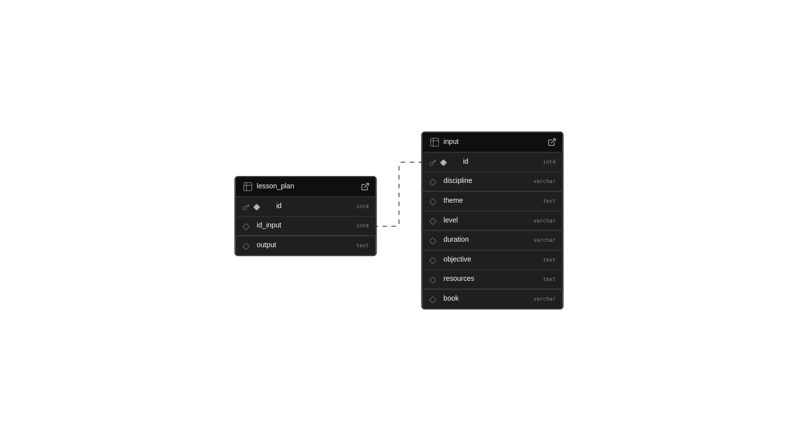

# 🤖 Plano de Aula com IA

Este projeto é um gerador de planos de aula que utiliza o Gemini, a Inteligência Artificial Generativa do Google. O objetivo é criar planos de aula personalizados e armazená-los de forma eficiente no Supabase.

## 🚀 Começando

Para executar este projeto localmente, você precisará ter o [Node.js](https://nodejs.org/) (versão 18 ou superior) e o [npm](https://www.npmjs.com/) instalados em sua máquina.

### Passos para Instalação

1.  **Clone o repositório:**

    ```bash
    git clone https://github.com/Allan-Gabriell/AI-lesson-plan-generator.git
    cd seu-repositorio
    ```

2.  **Instale as dependências:**

    ```bash
    npm install
    ```

3.  **Inicie o servidor de desenvolvimento:**

    ```bash
    npm run dev
    ```

Após esses passos, a aplicação estará disponível em `http://localhost:5173/`.

## Funcionalidades

### Formulário de Geração


### Geração do Plano


### Plano de Aula Gerado


### Vídeo de Demonstração

[Assista ao vídeo de demonstração](src/assets/Design%20sem%20nome%20(1).mp4)

## 🛠️ Configuração do Supabase

Este projeto utiliza o Supabase como backend para armazenamento de dados.

### 1. Crie um Projeto no Supabase

Se você ainda não tiver uma conta, crie uma em [supabase.com](https://supabase.com/) e configure um novo projeto.

### 2. Schema do Banco de Dados

Execute o seguinte script SQL no seu editor de SQL do Supabase para criar as tabelas necessárias:

```sql
-- Tabela para armazenar os inputs do usuário
CREATE TABLE input (
    id SERIAL PRIMARY KEY,
    discipline VARCHAR(255),
    theme VARCHAR(255),
    level VARCHAR(255),
    duration VARCHAR(255),
    objective TEXT,
    resources TEXT,
    book TEXT,
    created_at TIMESTAMP WITH TIME ZONE DEFAULT timezone('''utc'''::text, now()) NOT NULL
);

-- Tabela para armazenar os planos de aula gerados
CREATE TABLE lesson_plan (
    id SERIAL PRIMARY KEY,
    id_input INTEGER REFERENCES input(id),
    output JSONB,
    created_at TIMESTAMP WITH TIME ZONE DEFAULT timezone('''utc'''::text, now()) NOT NULL
);
```

A estrutura do banco de dados seguirá o schema abaixo:



### 3. Configuração da Edge Function

A Edge Function `integration-gemini` é o coração da integração com a IA. Ela recebe os dados do frontend, chama a API do Gemini e salva o resultado no banco de dados.

**Como configurar:**

1.  Navegue até a seção **Edge Functions** no painel do seu projeto Supabase.
2.  Clique em **Create a new function**.
3.  Nomeie a função como `integration-gemini`.
4.  Copie o conteúdo do arquivo `supabase/integration-gemini.js` (localizado na raiz deste projeto) e cole no editor da Edge Function.
5.  Faça o deploy da função.

### 4. Variáveis de Ambiente

Para que a Edge Function funcione, você precisa configurar uma variável de ambiente (Secret) no seu projeto Supabase:

1.  Gere uma API Key no [Google AI Studio](https://aistudio.google.com/).
2.  No painel do Supabase, vá em **Settings** > **Secrets**.
3.  Crie um novo secret com o nome `GEMINI_API_KEY` e cole a sua chave da API do Gemini como valor.

## Links Úteis

- **Edge Function URL:** https://tbbdevnnzskkvmjljjut.supabase.co/functions/v1/integration-gemini
- **Supabase Project URL:** https://supabase.com/dashboard/project/tbbdevnnzskkvmjljjut

## Decisões Técnicas

- **Frontend:** React com TypeScript, utilizando Vite para um desenvolvimento rápido e eficiente.
- **Backend:** Supabase, aproveitando seu banco de dados Postgres e Edge Functions para a lógica de servidor.
- **Integração AI:** A comunicação com a API do Gemini é feita através de uma Edge Function no Supabase, escrita em JavaScript.
- **Estilização:** Utilização de componentes de UI pré-construídos (shadcn/ui) para uma interface consistente e moderna.

## Desafios Encontrados

Um dos principais desafios foi determinar quais parâmetros deveriam compor a tabela de `input` do usuário e, consequentemente, o prompt para a geração do plano de aula. A solução envolveu pesquisa na web para entender a estrutura de um plano de aula completo. O principal recurso utilizado foi o artigo [Plano de aula (como fazer, modelo e exemplos)](https://www.todamateria.com.br/plano-de-aula/) do site Toda Matéria.

## Justificativa da Escolha do Modelo

**Geração Estruturada (JSON Mode):** O requisito principal do projeto é a geração de um plano de aula completo em um formato JSON estrito, utilizando um jsonSchema detalhado. O gemini-2.5-flash tem excelente desempenho em tarefas de extração e geração de dados estruturados (JSON Mode), garantindo alta precisão no formato.

**Velocidade e Latência:** O gemini-2.5-flash é otimizado para tarefas mais rápidas e de menor latência. Como esta função é acionada por um frontend e o usuário está esperando pelo resultado, a velocidade é crucial para uma boa experiência do usuário.

**Custo-Benefício:** O teste técnico solicita o uso gratuito da API. O gemini-2.5-flash oferece o melhor desempenho para a geração estruturada a um custo computacional muito mais baixo (o que se traduz em maior capacidade de uso no nível gratuito).

---

Com tudo configurado, você está pronto para gerar planos de aula incríveis com o poder da IA! ✨